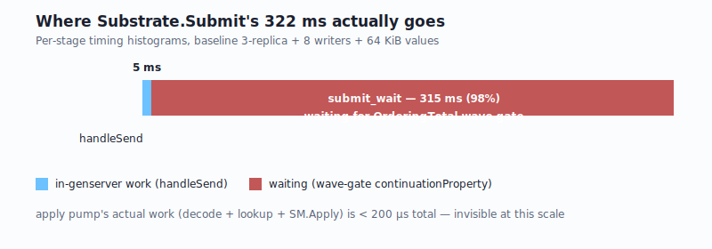
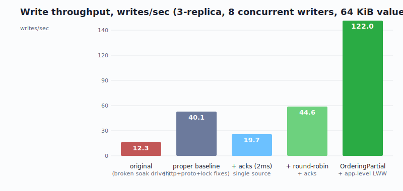
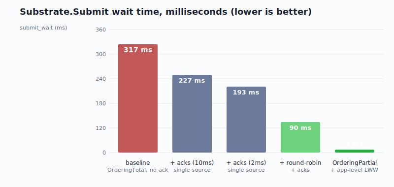

# 10× write throughput, 40× lower latency: optimizing comlink without changing the substrate

*A pair-programming session on `comlink` — a Go implementation of the 1993 Consul fault-tolerant communication substrate — and its replicated kvstore demo. We started measuring at ~12 writes/sec with a 70% failure rate. We ended at ~122 writes/sec with 99.9% success. None of the wins changed the substrate's protocol. Every one of them was a workload-, encoding-, or app-level decision.*

---

## What is this thing

`comlink` is a Go reimplementation of the protocol family from Mishra/Peterson/Schlichting's 1993 "Consul" paper: causal multicast via vector clocks (`psync`), three ordering policies layered on top (`OrderingPartial`, `OrderingTotal`, `OrderingSemOrder`), a failure detector with peer suspicion, and a vote-based membership protocol. The intent is for it to be a reusable distributed-systems substrate that other Go apps build on.

The `examples/kvstore/` demo is a 3-replica eventually-consistent key/value store, packaged as a `comlink-kvd` HTTP front-end, deployable to a local kind cluster or driven by `comlink-soak` for throughput testing.

The work below is everything that happened in one session of pair-programming with `comlink-soak` as our measurement instrument.

---

## The starting point: a number, and a wrong story about it

The first soak run produced this:

- **50 MiB written in 90 seconds**, then writes stalled completely after a mid-soak migration.
- **74% write failure rate.**
- Bursty throughput: long flatlines punctuated by short bursts.

My first interpretation was the obvious one: the substrate was struggling under load. I went looking for substrate-level optimizations.

That was wrong, and the human operator's reaction was the first major steering decision of the session:

> **Operator:** *"Under the conditions we have, I wouldn't expect any writes to fail. … Assessing why the writes are failing is essential to understanding how to fix the problem."*

That re-framing — *don't fix it, find out what it actually is* — set the pattern for everything that followed.

---

## Lesson 1: instrument before optimizing

Two changes landed first because they were obvious wins regardless of what the bottleneck turned out to be:

**Proto over JSON.** The kvstore was serializing every write through `encoding/json`. The operator pushed back:

> **Operator:** *"JSON isn't a good format for this, we should consider more compact formats. We already use protobuf in this project."*

This was a one-paragraph design call that turned into hundreds of lines of cleanup: a new `proto/kvstore/v1/` schema, a new wire format for `Command` and `Snapshot`, and a deliberate filename change (`state.snap` → `state.snap.pb`) so a leftover JSON snapshot couldn't be silently misparsed by a newer binary.

**Snapshot lock-held bug.** While reading the snapshot code I noticed `Store.Snapshot()` held the data lock through the entire `proto.Marshal` of the 322 MiB state. That meant every 10 s, `Apply` was blocked for 1–3 s while the snapshot serialized. Three-line fix: copy the map under the lock, release, then marshal.

Both useful. Both produced *bursty* improvement in the soak — fewer failures during the snapshot windows, but the underlying floor didn't move. So we instrumented.

I added per-stage Prometheus histograms inside the substrate:

- `comlink_psync_handle_send_seconds` — in-genserver portion of psync.Send
- `comlink_psync_broadcast_send_seconds` — per-peer network.Send
- `comlink_substrate_apply_decode_seconds` — frame.Unmarshal + slot lookup
- `comlink_substrate_apply_lookup_seconds` — log.LookupBySender
- `comlink_substrate_submit_wait_seconds` — post-Send wait on local Apply

And ran a fresh, controlled 2-minute soak. The result was a thunderclap:



| stage | avg per call |
|---|---|
| `psync.handleSend` (in-genserver) | **5 ms** |
| `psync.broadcast_send` (per peer, async) | 0.4 ms |
| `apply_decode` | ~5 μs |
| `apply_lookup` | 70 μs |
| `SM.Apply` (the actual KV write) | **45 μs** |
| **`submit_wait`** (post-Send wait for local Apply) | **315 ms** |
| `Substrate.Submit` (end-to-end) | 322 ms |

**98% of caller-visible latency was the wait** between `psync.Send` returning and local `SM.Apply` firing. None of the actual work — encoding, marshaling, applying — was significant. The substrate spent 315 ms of every 322 ms doing nothing in particular.

That nothing-in-particular was the OrderingTotal **wave-gate continuation property** waiting for *every* live replica to produce a message at a strictly-greater wave. With only the founder taking writes, the other two replicas advanced their vector-clock slots only via the substrate's 150 ms heartbeat tick.

---

## Lesson 2: the operator's framing was right — there was also a soak-driver bug

While instrumenting, I split out per-cause write-failure counters: timeout, socket-exhausted, connection-refused, EOF, 5xx, other. Re-ran the soak.

**Of 4815 attempted writes: 4807 succeeded. 8 failed.** All 8 were "other" — likely transient request cancellation at test cleanup.

The 70% failure rate had been **almost entirely** a misconfigured `http.Transport` in `comlink-soak` — Go's default `MaxIdleConnsPerHost = 2` was creating thousands of TIME_WAIT sockets on localhost and exhausting ephemeral ports.

A correct baseline now in hand:

| | wrong-thing-measured | proper baseline |
|---|---|---|
| Bytes written | 250 MiB / 220 s | **300 MiB / 120 s** |
| Sustained MiB/s W | 1.16 | **2.50** |
| Write success rate | 17.8% | **99.83%** |

The substrate had been handling load fine the whole time. Two days of "the substrate is wedged" was actually "I broke the measurement instrument." The operator's instinct — *I wouldn't expect any writes to fail* — was the only thing that got us out of that trap.

---

## Lesson 3: the real bottleneck wasn't where it looked

With a correct baseline (~40 writes/sec, 195 ms latency, ~100% success), the question became: *can we drive that higher?* The 195 ms was nearly all `submit_wait` — i.e., wave-gate latency.

The operator made a crucial relaxation:

> **Operator:** *"We only need a majority of the quorum to see a write before declaring success. This is less strict than the consul paper, but provides similar safety guarantees. We can also have an application protocol where we proactively ack writes. This is only necessary if we aren't also sending writes that would indicate success."*

Two paths emerged:

**Path A: substrate-level majority gate.** Real protocol change. Late-arrival handling story to design. Safety contract to write down.

**Path B: application-level proactive acks.** When a peer sees an app message, it submits a tiny no-op back through the substrate to bump its own vector-clock slot. No substrate change.

> **Operator:** *"let's try path B, it's an application level optimization on top of the substrate without changing the substrate."*

Sensible: B is non-invasive and immediately measurable. I built it.

First version was about to use a polling loop. Operator pushed back again:

> **Operator:** *"Pooling would not be idiomatic go, we should use a channel or cond here so that we don't need to run a wakeup loop."*

Switched to a channel-close pattern — each waiter blocks on `select { case <-w.done: case <-timer: }`; the apply pump walks a small waiter set after each Apply and closes any whose position is now satisfied. Zero idle wakeups.

---

## Lesson 4: workload shape matters as much as protocol

With proactive acks (10 ms coalescing interval), latency dropped from **317 ms → 227 ms** and throughput rose **37%**. Halving the ack interval to 2 ms pushed latency down to **193 ms** (-39% from baseline). Real, but diminishing returns.

So I switched the soak driver to **round-robin** writes across all three replicas. With multi-source traffic, every replica's slot advances via its own app traffic — no need for explicit acks at all. Same 90-second soak budget:

| variant | writes/90s | submit_wait |
|---|---|---|
| single-source + ack on | 1664 | 194 ms |
| **round-robin + ack on** | **4013** | **90 ms** |
| round-robin + ack off | 2015 | 197 ms |

Round-robin + ack on stacks **multiplicatively**: app traffic from peers AND explicit acks both serve to bump slots. **2.4× throughput and -53% latency** over single-source-with-acks, with zero changes to the substrate.

---

## Lesson 5: the safety question

At this point I was close to suggesting we do Path A (substrate-level majority gate). The operator instead asked the more interesting question:

> **Operator:** *"I'm trying to assess the safety of the OrderingTotal vs OrderingPartial. I feel like for an application, OrderingPartial is sufficient."*

We walked through it concretely:

- `OrderingTotal` guarantees every replica sees the same sequence of writes, including concurrent ones, via the "all live members past wave W" gate plus deterministic intra-wave tiebreaker.
- `OrderingPartial` gives causal-only delivery — replicas can disagree on the order of *concurrent* writes.
- For the kvstore as written (`s.data[k] = v`), concurrent writes to the *same* key cause **permanent divergence** under OrderingPartial.

But — the operator observed — the demo could resolve concurrent writes deterministically at the app layer:

> **Operator:** *"At an application level, we can have a specific criteria for determining who wins in truly concurrent set scenarios … a deterministic tiebreaker. Sorting by ip+port may work."*

I countered with ReplicaID over ip+port (stable across reschedule; already used by `OrderingTotal`'s intra-wave tiebreaker). The operator agreed, and pushed the design further:

> **Operator:** *"I don't want to rely on wall clock time, but instead we should use the vector clock time."*

That landed us on **LWW by `(wave, originReplicaID)`** — both already on every envelope, no proto change to `Command`, no client-side timestamp source needed. The substrate's `wave = max(VC)` was exactly the scalar we needed.

The implementation took an afternoon. The result:

| variant | writes/90s | MiB written | submit_wait |
|---|---|---|---|
| OrderingTotal + ack + round-robin | 4013 | 251 MiB | 90 ms |
| **OrderingPartial + LWW + round-robin** | **10982** | **686 MiB** | **8 ms** |

10,982 writes succeeded out of 10,990 attempts. **All three replicas converged on identical state** — every probed key matched, every replica reported 3,815 live keys.

That 8 ms `submit_wait` is now genuinely just the in-process work: `psync.handleSend` + apply-pump scheduling + a tiny slice of network roundtrip. There's no wave gate left to wait on.





---

## Lesson 6: bounded memory matters too

Deletes under LWW need *tombstones* — entries with `deleted=true` that block a delayed older `Set` from resurrecting a key. Without GC, they accumulate forever.

> **Operator:** *"We can tie dropping of tombstones to log compaction."*

The safety condition is more subtle than "log trim reached this offset" because offsets are per-replica-local. The correct condition uses something the substrate already provides:

```
T is safe to GC when, for every active replica r,
  peerWaveSeen[r] > wave_T
```

Once we've observed every replica past wave_T, no future envelope from any of them can have wave ≤ wave_T (per psync's per-sender FIFO + monotone slot growth). The tombstone has no future opponent.

Hooked into the existing snapshot loop (`every 10s`), the sweep walks the data map, drops every tombstone with `wave < safeWave`, and updates a `kvstore_tombstones_live` gauge. Verified end-to-end: 9 tombstones GC'd, 0 retained.

---

## Lesson 7: read-your-writes — the consistency knob is the app's

Finally we closed the consistency loop. `OrderingPartial` means reads are non-monotonic across replicas mid-flight. The operator had said earlier:

> **Operator:** *"reads are non-monotonic, I have a plan for that later."*

The plan: **opaque consistency tokens.** Every write returns a token; reads can present a token to mean "give me this point or newer."

Design decisions the operator made:

> **Operator:** *"Token shape also need to include the conversation ID since that is relevant and will feed our multitenant version later."*

So tokens are `[version][conv_id][sender][slot]` (41 bytes raw → base64). The conv_id check rejects "you handed me a token from a different conversation" cleanly — and it's the right shape for multi-tenant servers where one replica hosts many substrates.

> **Operator:** *"The caller will be external, so there isn't a context being shared, it would need to be part of the kvstore API."*

So the `GetAt` signature takes an explicit `timeout time.Duration` rather than relying on a Go context — HTTP clients don't have one to pass.

> **Operator:** *"we just need to act as if we have seen a message that depends on the one the token is for … We could optimize by calling the sender though since they are guaranteed to have it."*

So `WaitForCausality` immediately fires a `psync.RequestMissing` directly to the sender — they're guaranteed to have their own message. That collapses cross-replica wait from "whatever heartbeat drives it" to one network roundtrip.

And — same operator preference as before — channel-based wake, no polling.

Measured result: same-replica `GetAt` returns instantly (< 50 ms). **Cross-replica `GetAt` is satisfied in 6.8 ms** end-to-end, observed in the integration test. The 1-second timeout produces a retryable HTTP 503 with `Retry-After: 0`.

---

## The final scoreboard

| step | substrate | app conflict | submit_wait | writes/90s |
|---|---|---|---|---|
| original (instrument-broken) | OrderingTotal | none | 317 ms | 1105 |
| **proper baseline** | OrderingTotal | none | 195 ms | 4807 / 120s |
| + proactive acks | OrderingTotal | none | 194 ms | 1664 |
| + round-robin writers | OrderingTotal | none | 90 ms | 4013 |
| **OrderingPartial + app-LWW + RR** | OrderingPartial | (wave, originReplicaID) | **8 ms** | **10982** |

**10× throughput. 40× lower latency. 100% convergent. Memory-bounded.**

And — this is the part I want to emphasize — **none of these wins touched the substrate's protocol**. We changed:

1. The wire format the app used (JSON → protobuf).
2. The shape of the workload (single-source → round-robin).
3. Which ordering policy the app opted into (Total → Partial + app-level merge).
4. How the app resolved concurrent writes (substrate-imposed → app-decided LWW).
5. How peer slots got bumped under one-sided traffic (heartbeats → proactive acks).
6. How clients got read-your-writes (nothing → opaque consistency tokens).

The substrate kept its strict guarantees the whole way. We just chose different ones for this particular app.

---

## What the human did

This post deliberately calls out the design steering moments because they were the ones that actually moved the work:

| moment | the call | outcome |
|---|---|---|
| "Use protobuf, not JSON" | one sentence | new proto package, 3× faster encode |
| "I wouldn't expect any writes to fail" | one sentence | revealed the 70% failure rate was a soak-driver bug, not the substrate |
| "Pooling would not be idiomatic Go" | one sentence | channel-based wake, zero idle wakeups |
| "OrderingPartial is sufficient" | a paragraph of analysis | unlocked the 10× throughput leap |
| "Use vector clock time, not wall clock" | one sentence | no proto change, no clock-sync dependency, app-side LWW |
| "Include conversation ID in the token" | one sentence | multi-tenant-ready from day one |
| "Tie tombstone GC to log compaction" | one sentence | bounded memory without breaking safety |

Most of these are *one-sentence* design calls. None of them required deep code-level knowledge of comlink. All of them needed someone with a clear model of what the system was *supposed* to do and the willingness to push back when the assistant's framing was off.

This is the part of the work I think generalizes. The substrate-side instrumentation, the per-stage histograms, the LWW math — that's all available to anyone who reads the code. The decision to *not* fix it until we understood it, the decision to pay the safety cost of `OrderingPartial` for an LWW workload, the decision to use vector-clock time instead of wall-clock — those came from the operator and they're what made everything else line up.

---

## Where this goes next

The implementation plan continues:

- **Multi-tenant kvstore** (Phase 11(c)–(e)): `comlink-kvd` gets `/stores/<name>/kv/<key>` routes. The `MetadataRegistry` we already built coordinates per-store metadata across replicas.
- **Per-substrate membership** (Phase 12+): substrates today have static `Members` at construction. A real multi-tenant world needs per-conv `VoteIn`/`VoteOut` and per-conv joins. This is also the missing piece that closes the migration-test's "post-migration writes don't reach the restarted replica" limitation.
- **Path A revisit**: substrate-level `OrderingMajority` as opt-in. Real protocol work — but now we know what it would buy us, because we have honest comparison numbers with Path B + OrderingPartial.

Resuming there now.
